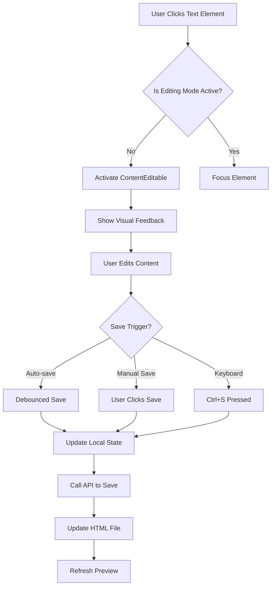

# PPT Inline Editing Implementation Plan

## 📋 Overview

Implement full inline editing capability for PPT slides, allowing users to click any text element (h1, h2, p, etc.) in the preview and edit directly with visual feedback. Changes will persist to the HTML files.

## 🎯 Objectives

1. **Direct Editing**: Click any text element to edit in-place
2. **Visual Feedback**: Clear indicators for editable and actively editing elements
3. **Persistence**: Save changes back to `public/slides/*.html` files
4. **User Experience**: Smooth transitions, undo/redo, keyboard shortcuts

## 🏗️ Architecture Design

### Current Architecture Challenges

**Problem 1: iframe Isolation**
- Slides currently render in `<iframe>` elements (lines 881-890, 838-842 in [`studio.tsx`](src/app/[locale]/studio.tsx:881))
- iframes create isolated DOM contexts, blocking direct interaction
- Cannot attach event listeners or make content editable from parent

**Problem 2: Static HTML Loading**
- Slides loaded as complete HTML documents via API
- Content is opaque - can't easily identify editable elements
- No structured data model for slide content

**Problem 3: File System Persistence**
- Need to write back to `public/slides/*.html` files
- Requires server-side API with filesystem access
- Edge runtime limitations may need consideration

### Proposed Solution Architecture



## 🔧 Technical Implementation

### 1. Replace iframe with Direct Rendering

**Current:**
```tsx
<iframe srcDoc={previewHtml} />
```

**New:**
```tsx
<div dangerouslySetInnerHTML={{ __html: processedHtml }} />
```

**Rationale:**
- Direct DOM access for event handling
- Can apply contentEditable attributes
- Better performance for interactions

**Trade-offs:**
- Potential style conflicts with parent
- Need CSS isolation via Shadow DOM or scoped styles
- Reveal.js initialization needs adjustment

### 2. Content Processing Pipeline

```typescript
interface EditableElement {
  selector: string;
  xpath: string;
  originalContent: string;
  currentContent: string;
  elementType: 'h1' | 'h2' | 'h3' | 'p' | 'span' | 'li';
}

interface SlideState {
  id: number;
  originalHtml: string;
  currentHtml: string;
  editableElements: EditableElement[];
  isDirty: boolean;
  history: string[];
  historyIndex: number;
}
```

**Processing Steps:**
1. Parse HTML with DOMParser
2. Identify editable elements (h1, h2, h3, p, span, li)
3. Add data attributes for tracking
4. Inject event listeners
5. Apply visual styling for editability

### 3. State Management Structure

```typescript
// Context for editing state
interface EditorContextValue {
  isEditMode: boolean;
  setEditMode: (mode: boolean) => void;
  activeElement: string | null;
  setActiveElement: (id: string | null) => void;
  slideStates: Map<number, SlideState>;
  updateContent: (slideId: number, xpath: string, content: string) => void;
  saveSlide: (slideId: number) => Promise<void>;
  undo: () => void;
  redo: () => void;
  canUndo: boolean;
  canRedo: boolean;
}
```

### 4. Component Architecture

```
components/
├── SlideEditor/
│   ├── SlideEditorProvider.tsx      # Context provider for editing state
│   ├── EditableSlidePreview.tsx     # Replaces iframe rendering
│   ├── EditableElement.tsx          # Wrapper for editable elements
│   ├── EditingControls.tsx          # Save/Cancel/Undo/Redo toolbar
│   └── useSlideEditor.ts            # Custom hook for editor logic
└── ui/
    └── editable-indicator.tsx       # Visual feedback component
```

### 5. API Endpoints

**New Endpoint: `PUT /api/slides/[id]`**

```typescript
// app/api/slides/[id]/route.ts
export async function PUT(
  request: NextRequest,
  { params }: { params: { id: string } }
) {
  const { content } = await request.json();
  const slideId = parseInt(params.id);
  
  // Validate and sanitize content
  const sanitizedContent = sanitizeHtml(content);
  
  // Write to file system
  const filePath = path.join(process.cwd(), 'public', 'slides', `slide-${slideId}.html`);
  await fs.writeFile(filePath, sanitizedContent, 'utf-8');
  
  return NextResponse.json({ success: true });
}
```

**Runtime Considerations:**
- Use Node.js runtime (not edge) for file system access
- Add proper error handling and validation
- Implement file locking to prevent concurrent writes

### 6. Visual Feedback System

**States:**
1. **Editable** (default): Subtle border on hover
2. **Active** (editing): Highlighted border, focus ring
3. **Dirty** (unsaved): Orange indicator
4. **Saving**: Loading spinner
5. **Saved**: Green checkmark (temporary)

**CSS Implementation:**
```css
[data-editable] {
  cursor: text;
  transition: all 0.2s;
  border: 2px solid transparent;
  padding: 4px;
  border-radius: 4px;
}

[data-editable]:hover {
  border-color: rgba(59, 130, 246, 0.3);
  background: rgba(59, 130, 246, 0.05);
}

[data-editable][contenteditable="true"] {
  border-color: #3b82f6;
  background: rgba(59, 130, 246, 0.1);
  outline: none;
}

[data-editable][data-dirty="true"]::after {
  content: "●";
  color: #f59e0b;
  margin-left: 8px;
}
```

### 7. Event Handling Flow

```typescript
// Click handler
const handleElementClick = (e: React.MouseEvent) => {
  const target = e.target as HTMLElement;
  const editableElement = target.closest('[data-editable]');
  
  if (!editableElement) return;
  
  const xpath = editableElement.getAttribute('data-xpath');
  if (!xpath) return;
  
  // Activate editing
  editableElement.setAttribute('contenteditable', 'true');
  editableElement.focus();
  setActiveElement(xpath);
};

// Blur handler (auto-save)
const handleElementBlur = (e: React.FocusEvent) => {
  const target = e.target as HTMLElement;
  const xpath = target.getAttribute('data-xpath');
  const newContent = target.innerHTML;
  
  // Deactivate editing
  target.setAttribute('contenteditable', 'false');
  
  // Update state and trigger save
  updateContent(currentSlideId, xpath, newContent);
  debouncedSave(currentSlideId);
};

// Input handler (track changes)
const handleInput = (e: Event) => {
  const target = e.target as HTMLElement;
  const xpath = target.getAttribute('data-xpath');
  const newContent = target.innerHTML;
  
  updateContent(currentSlideId, xpath, newContent);
};
```

### 8. Undo/Redo Implementation

```typescript
class EditHistory {
  private history: string[] = [];
  private currentIndex = -1;
  private maxSize = 50;

  push(state: string) {
    // Remove future states if we're in the middle
    this.history = this.history.slice(0, this.currentIndex + 1);
    
    // Add new state
    this.history.push(state);
    
    // Limit size
    if (this.history.length > this.maxSize) {
      this.history.shift();
    } else {
      this.currentIndex++;
    }
  }

  undo(): string | null {
    if (this.currentIndex > 0) {
      this.currentIndex--;
      return this.history[this.currentIndex];
    }
    return null;
  }

  redo(): string | null {
    if (this.currentIndex < this.history.length - 1) {
      this.currentIndex++;
      return this.history[this.currentIndex];
    }
    return null;
  }

  canUndo(): boolean {
    return this.currentIndex > 0;
  }

  canRedo(): boolean {
    return this.currentIndex < this.history.length - 1;
  }
}
```

### 9. Auto-Save Strategy

```typescript
// Debounced save (2 seconds after last edit)
const debouncedSave = useMemo(
  () => debounce(async (slideId: number) => {
    try {
      setSaveStatus('saving');
      await saveSlide(slideId);
      setSaveStatus('saved');
      setTimeout(() => setSaveStatus('idle'), 2000);
    } catch (error) {
      setSaveStatus('error');
      console.error('Save failed:', error);
    }
  }, 2000),
  [saveSlide]
);
```

### 10. Keyboard Shortcuts

```typescript
useEffect(() => {
  const handleKeyDown = (e: KeyboardEvent) => {
    // Ctrl/Cmd + S: Save
    if ((e.ctrlKey || e.metaKey) && e.key === 's') {
      e.preventDefault();
      saveCurrentSlide();
    }
    
    // Ctrl/Cmd + Z: Undo
    if ((e.ctrlKey || e.metaKey) && e.key === 'z' && !e.shiftKey) {
      e.preventDefault();
      undo();
    }
    
    // Ctrl/Cmd + Shift + Z: Redo
    if ((e.ctrlKey || e.metaKey) && e.key === 'z' && e.shiftKey) {
      e.preventDefault();
      redo();
    }
    
    // Escape: Cancel editing
    if (e.key === 'Escape') {
      cancelEditing();
    }
  };
  
  document.addEventListener('keydown', handleKeyDown);
  return () => document.removeEventListener('keydown', handleKeyDown);
}, []);
```

## 🎨 User Interface Updates

### Editing Toolbar

Add floating toolbar at top of preview area:

```
┌─────────────────────────────────────────────┐
│ [Edit Mode: ON]  [Save] [Cancel]  [↶] [↷]  │
│  ● Unsaved changes                          │
└─────────────────────────────────────────────┘
```

**Controls:**
- Edit Mode Toggle
- Save Button (with status)
- Cancel Button (reverts to original)
- Undo/Redo Buttons
- Change indicator

## 🔐 Security Considerations

### Input Sanitization

```typescript
import DOMPurify from 'isomorphic-dompurify';

const sanitizeHtml = (html: string): string => {
  return DOMPurify.sanitize(html, {
    ALLOWED_TAGS: [
      'h1', 'h2', 'h3', 'h4', 'h5', 'h6',
      'p', 'span', 'div', 'section',
      'ul', 'ol', 'li',
      'strong', 'em', 'u', 'br',
      'a', 'img'
    ],
    ALLOWED_ATTR: [
      'class', 'id', 'style',
      'href', 'src', 'alt',
      'data-background'
    ],
    ALLOW_DATA_ATTR: false
  });
};
```

### File System Validation

```typescript
const validateSlideId = (id: number): boolean => {
  return id >= 1 && id <= 10 && Number.isInteger(id);
};

const getSecureFilePath = (slideId: number): string => {
  if (!validateSlideId(slideId)) {
    throw new Error('Invalid slide ID');
  }
  
  const filename = `slide-${slideId}.html`;
  const safePath = path.join(process.cwd(), 'public', 'slides', filename);
  
  // Prevent path traversal
  if (!safePath.startsWith(path.join(process.cwd(), 'public', 'slides'))) {
    throw new Error('Invalid file path');
  }
  
  return safePath;
};
```

## 🧪 Testing Strategy

### Unit Tests
- Content processing and sanitization
- History management (undo/redo)
- XPath generation and element identification
- State management

### Integration Tests
- Click-to-edit workflow
- Auto-save functionality
- API endpoint for saving
- File system writes

### E2E Tests
1. User clicks title → becomes editable
2. User types new content → state updates
3. User clicks away → auto-saves
4. Page refresh → changes persist
5. Undo/redo → history works correctly

## 📦 Dependencies to Add

```json
{
  "dependencies": {
    "isomorphic-dompurify": "^2.11.0",
    "lodash.debounce": "^4.0.8"
  },
  "devDependencies": {
    "@types/lodash.debounce": "^4.0.9",
    "@types/dompurify": "^3.0.5"
  }
}
```

## 🚀 Implementation Phases

### Phase 1: Core Infrastructure (High Priority)
1. Replace iframe with direct HTML rendering
2. Create EditorProvider context
3. Implement basic contentEditable wrapper
4. Add click-to-edit handlers

### Phase 2: Persistence (High Priority)
1. Create API endpoint for saving
2. Implement file system writes
3. Add error handling and validation
4. Test save/load cycle

### Phase 3: User Experience (Medium Priority)
1. Visual feedback for editable elements
2. Editing toolbar with controls
3. Auto-save with debouncing
4. Save status indicators

### Phase 4: Advanced Features (Medium Priority)
1. Undo/redo functionality
2. Keyboard shortcuts
3. Dirty state tracking
4. Confirmation dialogs

### Phase 5: Polish & Testing (Low Priority)
1. Edge case handling
2. Comprehensive testing
3. Performance optimization
4. Documentation

## ⚠️ Known Limitations & Trade-offs

### Reveal.js Compatibility
- Direct rendering may affect Reveal.js slide transitions
- Need to reinitialize Reveal.js after content changes
- Some advanced Reveal.js features may not work in edit mode

### HTML Structure Changes
- Users can only edit text content, not restructure HTML
- Complex nested elements may be challenging to edit
- Style changes not supported (only content)

### Concurrent Editing
- No multi-user editing support
- Last write wins if multiple tabs open
- Consider adding file locking or version checking

### Performance
- Large slides may have lag with contentEditable
- Need to optimize re-renders during editing
- Consider virtualization for many editable elements

## 🎓 Best Practices

1. **Always sanitize user input** before saving
2. **Debounce auto-save** to reduce API calls
3. **Provide visual feedback** for all state changes
4. **Handle errors gracefully** with user-friendly messages
5. **Maintain undo history** for better UX
6. **Test with real slide content** to catch edge cases

## 📚 References

- [ContentEditable MDN](https://developer.mozilla.org/en-US/docs/Web/HTML/Global_attributes/contenteditable)
- [DOMPurify Documentation](https://github.com/cure53/DOMPurify)
- [Reveal.js API](https://revealjs.com/api/)
- [XPath in JavaScript](https://developer.mozilla.org/en-US/docs/Web/XPath)
